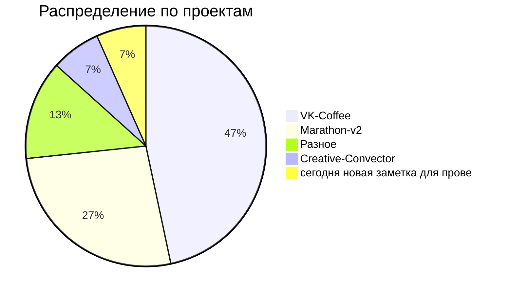

# 📊 Отчет о распределении заметок

**Дата:** 2026-02-02 18:59:05
**Обработано заметок:** 15
**Метод:** Анализ по ключевым словам

## 📈 График распределения

## 📋 Сводная таблица

| Проект | Количество заметок |
|--------|-------------------|
| VK-Coffee | 7 |
| Marathon-v2 | 4 |
| Разное | 2 |
| Creative-Convector | 1 |
| сегодня новая заметка для прове | 1 |

## 📝 Детали распределения

### 🆕 Новые проекты

- **Разное** - создана полная структура FPF
- **сегодня новая заметка для прове** - создана полная структура FPF

### 📁 VK-Coffee

Заметок: 7

- **Для собрания бариста 1.md**
  - Роль: F4 - Требования
  - Уверенность: 2/10
  - Описание: --- project: VK-Coffee role: F4 status: черновик created: 2026-01-31 updated: 2026-01-31 tags: ["обс...
  - Теги: обсудить, нужно, поднятие

- **Для Клода..md**
  - Роль: F4 - Требования
  - Уверенность: 2/10
  - Описание: --- project: VK-Coffee role: F4 status: черновик created: 2026-01-31 updated: 2026-01-31 tags: ["коф...
  - Теги: сделать, кофе, агент

- **Кухня.md**
  - Роль: F4 - Требования
  - Уверенность: 2/10
  - Описание: Думаю в дальнейшем переводим все объемы солёной еды на шефа маме Анна тургенева разворачиваем совмес...
  - Теги: шефа, маме, подумать

- **Для собрания бариста.md**
  - Роль: F4 - Требования
  - Уверенность: 2/10
  - Описание: --- project: VK-Coffee role: F4 status: черновик created: 2026-01-31 updated: 2026-01-31 tags: ["обс...
  - Теги: обсудить, нужно, поднятие

- **Контроль заявок 1.md**
  - Роль: F9 - Команда
  - Уверенность: 1/10
  - Описание: --- project: Разное role: F4 status: черновик created: 2026-01-31 updated: 2026-01-31 tags: ["назнач...
  - Теги: назначить, родиона, родион

- **Контроль заявок.md**
  - Роль: F9 - Команда
  - Уверенность: 1/10
  - Описание: --- project: Разное role: F4 status: черновик created: 2026-01-31 updated: 2026-01-31 tags: ["назнач...
  - Теги: назначить, родиона, родион

- **Заметка.md**
  - Роль: F4 - Требования
  - Уверенность: 3/10
  - Описание: --- project: VK-Coffee role: F4 status: черновик created: 2026-01-26 updated: 2026-01-26 tags: ["чув...
  - Теги: чувствую, чтобы, сегодня

### 📁 Marathon-v2

Заметок: 4

- **Марафон.md**
  - Роль: F4 - Требования
  - Уверенность: 2/10
  - Описание: --- project: Разное role: F4 status: черновик created: 2026-01-31 updated: 2026-01-31 tags: ["чувств...
  - Теги: чувствую, прикасаясь, марафону

- **Марафон бот 1.md**
  - Роль: F4 - Требования
  - Уверенность: 7/10
  - Описание: --- project: Разное role: F4 status: черновик created: 2026-01-31 updated: 2026-01-31 tags: ["прям",...
  - Теги: марафон, прям, описать

- **Марафон 1.md**
  - Роль: F4 - Требования
  - Уверенность: 2/10
  - Описание: --- project: Разное role: F4 status: черновик created: 2026-01-31 updated: 2026-01-31 tags: ["чувств...
  - Теги: чувствую, прикасаясь, марафону

- **Марафон бот.md**
  - Роль: F4 - Требования
  - Уверенность: 7/10
  - Описание: --- project: Разное role: F4 status: черновик created: 2026-01-31 updated: 2026-01-31 tags: ["прям",...
  - Теги: марафон, прям, описать

### 📁 Разное

Заметок: 2

- **Первая заметка.md**
  - Роль: F4 - Требования
  - Уверенность: 0/10
  - Описание: --- project: Тут заметка с телефона role: F4 status: черновик created: 2026-01-31 updated: 2026-01-3...
  - Теги: заметка, телефона, черновик

- **То что нужно Душе.md**
  - Роль: F4 - Требования
  - Уверенность: 0/10
  - Описание: --- project: Разное role: F4 status: черновик created: 2026-01-31 updated: 2026-01-31 tags: ["покрас...
  - Теги: покраска, стен, самокиша

### 📁 Creative-Convector

Заметок: 1

- **Что меня не устраивае.md**
  - Роль: F4 - Требования
  - Уверенность: 1/10
  - Описание: --- project: Разное role: F4 status: черновик created: 2026-01-31 updated: 2026-01-31 tags: ["заметк...
  - Теги: заметки, могу, понять

### 📁 сегодня новая заметка для прове

Заметок: 1

- **новая проверка.md**
  - Роль: F4 - Требования
  - Уверенность: 0/10
  - Описание: сегодня новая заметка для прове
  - Теги: сегодня, новая, заметка

---

## ✅ Следующие шаги

1. Просмотрите черновики в папке `2. Черновики/`
2. Проверьте правильность распределения
3. Доработайте содержание заметок
4. Переместите готовые заметки в `3. Приоритетные проекты/`

## 📊 Статистика

| Метрика | Значение |
|---------|----------|
| Всего проектов | 5 |
| Новых проектов | 2 |
| Обработано заметок | 15 |
| Дата обработки | 2026-02-02 18:59 |

## 📁 Где найти файлы

- **Черновики:** `2. Черновики/[Проект]/`
- **Оригиналы:** `System/Обработанные/2026-02-02/`
- **Отчёты:** `System/Отчёты AI/`

---

> ⚠️ **Примечание:** Распределение выполнено автоматически на основе ключевых слов.
> Проверьте правильность категоризации и при необходимости переместите заметки вручную.
